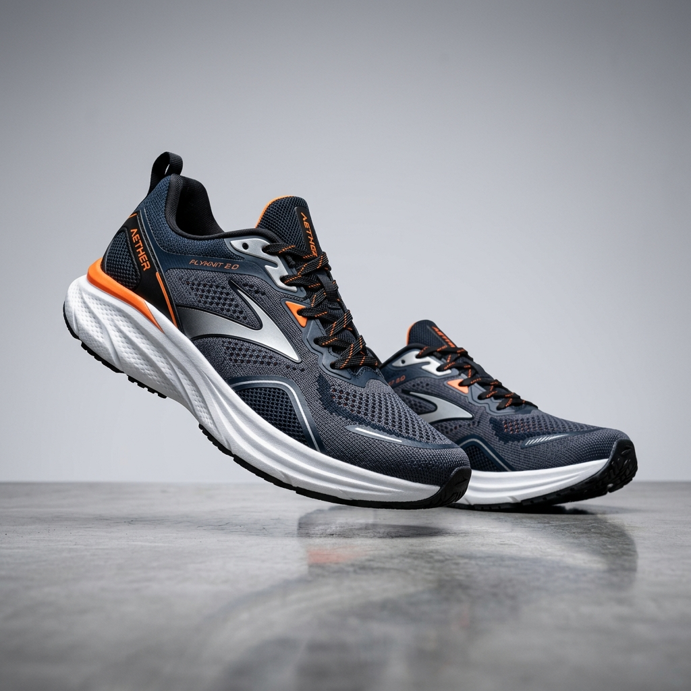
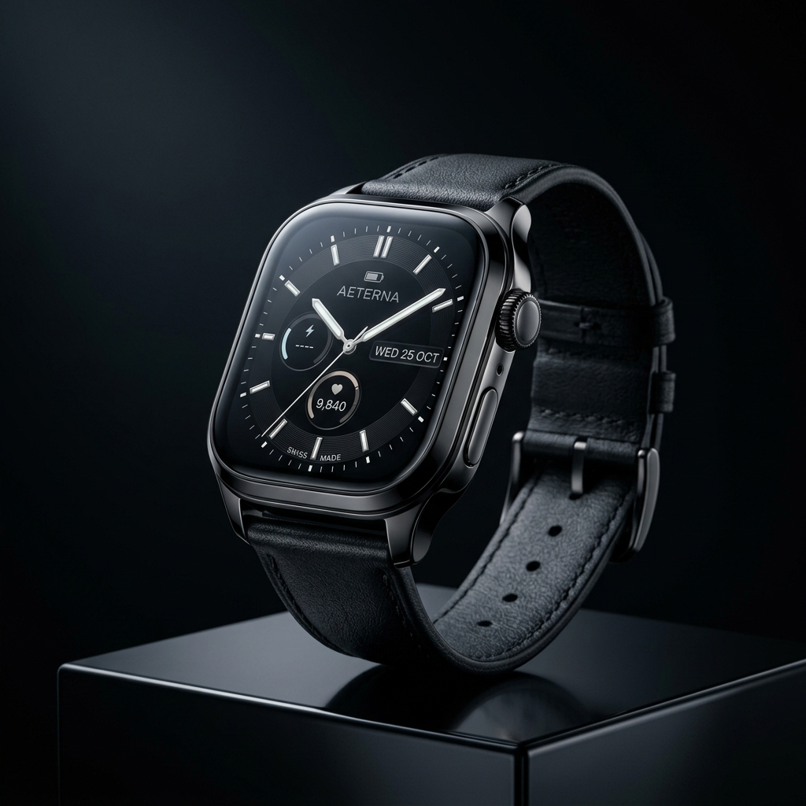
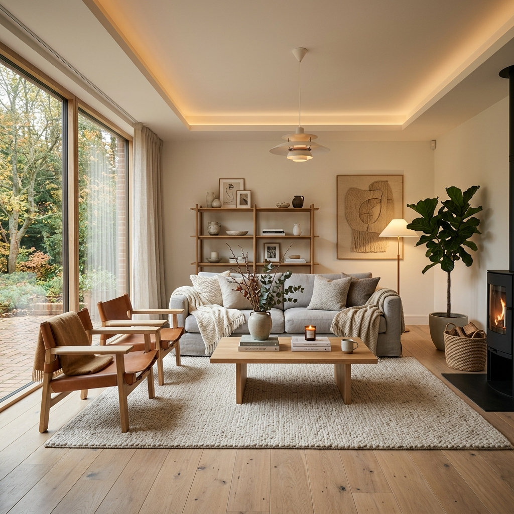

# Google Ads Simülasyon Mekanizması Spesifikasyon ve Uygulama Kılavuzu

Bu kılavuz, mevcut projede (Shopping Center) kullanılan **Google Ads (Sponsorlu Bağlantılar)** simülasyon mekanizmasını ve bu mekanizmanın başka bir projeye nasıl entegre edileceğini detaylandırmaktadır. 

Mekanizma, harici reklam yükleme scriptleri (Google AdSense vb.) kullanmak yerine tamamen **HTML, CSS (Flexbox/Grid) ve SVG** tabanlı çalışan statik görsel reklam bloklarından oluşur. Bu yöntem, yerel geliştirme süreçlerinde performansı etkilemeden ve reklam engelleyicilere takılmadan gerçekçi bir arayüz/gelir modeli tasarımı sunmak için son derece uygundur.

---

## 1. Mekanizmanın Çalışma Prensibi
Sistem, üç farklı reklam alanı varyasyonu sunmaktadır:
1. **Üst Metin Reklam Banner'ı (Top Text Ads Banner)**: Sayfa başında yer alan, yan yana 3 karttan oluşan ve tıklandığında hedefe yönlendiren metin tabanlı sponsorlu reklamlar.
2. **Alt Görsel Reklam Banner'ı (Bottom Display Ads Grid)**: Sayfa sonunda yer alan, yan yana 4 görsel karttan oluşan modern display/kare reklamlar.
3. **Küresel Alt Reklam Alanı (Global Footer Ads Section)**: Master page (Ana Şablon) seviyesinde yer alan, tüm sayfalarda en altta gösterilen metin tabanlı sponsorlu reklam alanı.

Tasarım, Google'ın gerçek arama ve ekran reklamlarında kullandığı renk paletleri, yazı tipleri, kenar boşlukları ve hover (üzerine gelme) efektleri ile birebir uyumlu olacak şekilde taklit edilmiştir.

---

## 2. Önkoşullar (Prerequisites)
Simülasyonun tam ve doğru çalışması için hedef projenizde şu kaynakların yüklü olması gerekir:
- **Yazı Tipi (Font)**: Google Fonts - `Inter` (veya benzeri modern bir sans-serif font).
- **İkon Kütüphanesi**: Bootstrap Icons (`bi` sınıfları).
- **Bootstrap CSS**: Grid sistemi ve container düzeni için (isteğe bağlıdır, düz CSS ile de uyarlanabilir).

Hedef projenizin `<head>` bloğuna eklemeniz gereken satırlar:
```html
<!-- Google Fonts - Inter -->
<link href="https://fonts.googleapis.com/css2?family=Inter:wght@300;400;500;600;700;800&display=swap" rel="stylesheet" />

<!-- Bootstrap Icons -->
<link href="https://cdn.jsdelivr.net/npm/bootstrap-icons@1.11.3/font/bootstrap-icons.min.css" rel="stylesheet" />
```

---

## 3. HTML Yapıları (Templates)

Aşağıdaki HTML şablonlarını projenizde reklam göstermek istediğiniz alanlara yerleştirebilirsiniz.

### Varyasyon A: Metin Tabanlı Sponsorlu Kartlar (Örn: Üst veya Footer Reklam Alanı)
Üç sütunlu, ikonlu veya küçük görselli, gerçekçi Google Ads arama sonuçlarına benzeyen yapı.

```html
<div class="google-ad-container">
    <!-- Reklam Üst Bilgi Barı -->
    <div class="google-ad-header">
        <span class="google-ad-badge">Sponsorlu</span>
        <span class="google-ad-powered">
            <svg class="google-ad-logo" viewBox="0 0 48 48" width="14" height="14">
                <circle cx="24" cy="24" r="22" fill="#4285F4" />
                <text x="50%" y="55%" text-anchor="middle" fill="white" font-size="24" font-weight="bold" dominant-baseline="middle">G</text>
            </svg>
            Google Ads
        </span>
    </div>
    
    <!-- Reklam Kartları Listesi -->
    <div class="google-ad-cards">
        <!-- Reklam 1 (İkonlu Seçenek) -->
        <div class="google-ad-card" onclick="window.open('https://mediamarkt.com.tr', '_blank')">
            <div class="google-ad-card-icon"><i class="bi bi-cpu-fill"></i></div>
            <div class="google-ad-card-content">
                <div class="google-ad-card-title">Teknoloji Fırsatları - MediaMarkt</div>
                <div class="google-ad-card-desc">En son teknoloji ürünlerinde kaçırılmayacak fırsatlar!</div>
                <div class="google-ad-card-link">mediamarkt.com.tr <i class="bi bi-box-arrow-up-right"></i></div>
            </div>
        </div>

        <!-- Reklam 2 (Küçük Görselli Seçenek) -->
        <div class="google-ad-card" onclick="window.open('https://samsung.com/tr', '_blank')">
            
            <div class="google-ad-card-content">
                <div class="google-ad-card-title">Samsung Galaxy S24 Ultra</div>
                <div class="google-ad-card-desc">Yapay zeka destekli yeni nesil akıllı telefon. Hemen keşfet!</div>
                <div class="google-ad-card-link">samsung.com/tr <i class="bi bi-box-arrow-up-right"></i></div>
            </div>
        </div>

        <!-- Reklam 3 -->
        <div class="google-ad-card" onclick="window.open('https://boyner.com.tr', '_blank')">
            <div class="google-ad-card-icon"><i class="bi bi-percent"></i></div>
            <div class="google-ad-card-content">
                <div class="google-ad-card-title">Sezon Sonu İndirimi - %80'e Varan</div>
                <div class="google-ad-card-desc">Moda markalarında büyük sezon sonu indirimi başladı!</div>
                <div class="google-ad-card-link">boyner.com.tr <i class="bi bi-box-arrow-up-right"></i></div>
            </div>
        </div>
    </div>
</div>
```

### Varyasyon B: Görsel Display Reklam Grid (Örn: Alt Reklam Alanı)
Kare banner şeklinde, üzerine resim yerleştirilen ve altında marka detayları içeren modern 4 sütunlu ekran reklamı düzeni.

```html
<div class="google-ad-container google-ad-bottom">
    <!-- Reklam Üst Bilgi Barı -->
    <div class="google-ad-header">
        <span class="google-ad-badge">Sponsorlu</span>
        <span class="google-ad-powered">
            <svg class="google-ad-logo" viewBox="0 0 48 48" width="14" height="14">
                <circle cx="24" cy="24" r="22" fill="#4285F4" />
                <text x="50%" y="55%" text-anchor="middle" fill="white" font-size="24" font-weight="bold" dominant-baseline="middle">G</text>
            </svg>
            Google Ads
        </span>
    </div>

    <!-- Display Reklam Grid -->
    <div class="google-ad-display-grid">
        <!-- Display Reklam 1 -->
        <div class="google-ad-display" onclick="window.open('https://trendyol.com', '_blank')">
            
            <div class="google-ad-display-info">
                <strong>Trendyol</strong>
                <small>%70'e varan indirim fırsatları</small>
            </div>
        </div>

        <!-- Display Reklam 2 -->
        <div class="google-ad-display" onclick="window.open('https://hepsiburada.com', '_blank')">
            
            <div class="google-ad-display-info">
                <strong>Hepsiburada</strong>
                <small>50 TL anında indirim kuponu</small>
            </div>
        </div>

        <!-- Display Reklam 3 -->
        <div class="google-ad-display" onclick="window.open('https://amazon.com.tr', '_blank')">
            
            <div class="google-ad-display-info">
                <strong>Amazon.com.tr</strong>
                <small>Prime üyelere özel ayrıcalıklar</small>
            </div>
        </div>

        <!-- Display Reklam 4 -->
        <div class="google-ad-display" onclick="window.open('https://n11.com', '_blank')">
            
            <div class="google-ad-display-info">
                <strong>N11.com</strong>
                <small>12 aya varan taksit seçenekleri</small>
            </div>
        </div>
    </div>
</div>
```

---

## 4. CSS Stil Kuralları (CSS Rules)
Projenizin ana CSS dosyasına (`Site.css`, `style.css` vb.) aşağıdaki kodları yapıştırın. Google tasarımlarının renk kodları (Google Mavisi, Google Yeşili, Google Grisi) bu stillere işlenmiştir.

```css
/* ============================================================
   GOOGLE ADS SİMÜLASYON STİLLERİ
   ============================================================ */

/* CSS Değişken Tanımları (İsteğe bağlı, doğrudan renk de yazabilir) */
:root {
    --google-blue: #4285f4;
    --google-blue-hover: #1a73e8;
    --google-ad-title-color: #1a0dab;
    --google-ad-link-color: #188038;
    --google-ad-desc-color: #4d5156;
    --google-ad-border: #e8e8e8;
    --google-ad-card-border: #f0f0f0;
    --google-ad-bg-hover: #f0f4ff;
    --google-ad-border-hover: #d2e3fc;
}

/* Genel dış kapsayıcı */
.google-ads-section {
    padding: 20px 0;
}

/* Reklam kutusu ana çerçevesi */
.google-ad-container {
    background: #ffffff;
    border: 1px solid var(--google-ad-border);
    border-radius: 10px;
    padding: 16px 20px;
    margin-bottom: 24px;
    box-shadow: 0 1px 4px rgba(0, 0, 0, .04);
    font-family: 'Inter', -apple-system, sans-serif;
}

.google-ad-top {
    margin-bottom: 28px;
}

.google-ad-bottom {
    margin-top: 32px;
}

/* Reklam başlık barı ("Sponsorlu" ve "Google Ads" yazısı) */
.google-ad-header {
    display: flex;
    align-items: center;
    justify-content: space-between;
    margin-bottom: 14px;
    padding-bottom: 10px;
    border-bottom: 1px solid #f0f0f0;
}

/* Sponsorlu Rozeti */
.google-ad-badge {
    background: #f1f3f4;
    color: #5f6368;
    padding: 3px 10px;
    border-radius: 4px;
    font-size: .7rem;
    font-weight: 600;
    text-transform: uppercase;
    letter-spacing: .5px;
}

/* Google Ads Yazısı ve Logo Hizalama */
.google-ad-powered {
    display: flex;
    align-items: center;
    gap: 5px;
    font-size: .72rem;
    color: #9aa0a6;
    font-weight: 500;
}

.google-ad-logo {
    flex-shrink: 0;
}

/* --- Metin Reklam Gridi (3 Sütun) --- */
.google-ad-cards {
    display: grid;
    grid-template-columns: repeat(3, 1fr);
    gap: 16px;
}

/* Reklam Kartı */
.google-ad-card {
    display: flex;
    gap: 14px;
    padding: 14px;
    border-radius: 6px;
    border: 1px solid var(--google-ad-card-border);
    background: #fafbfc;
    cursor: pointer;
    transition: all 0.25s ease;
}

/* Reklam Kartı Hover (Üzerine Gelindiğinde) */
.google-ad-card:hover {
    background: var(--google-ad-bg-hover);
    border-color: var(--google-ad-border-hover);
    box-shadow: 0 2px 8px rgba(66, 133, 244, .12);
}

/* Reklam Kartı İkon Kapsayıcı */
.google-ad-card-icon {
    width: 42px;
    height: 42px;
    background: linear-gradient(135deg, var(--google-blue), var(--google-blue-hover));
    border-radius: 8px;
    display: flex;
    align-items: center;
    justify-content: center;
    color: #fff;
    font-size: 1.1rem;
    flex-shrink: 0;
}

.google-ad-card-content {
    flex: 1;
    min-width: 0;
}

/* Google Reklam Mavi Başlığı */
.google-ad-card-title {
    font-size: .85rem;
    font-weight: 600;
    color: var(--google-ad-title-color);
    margin-bottom: 3px;
    white-space: nowrap;
    overflow: hidden;
    text-overflow: ellipsis;
}

.google-ad-card:hover .google-ad-card-title {
    text-decoration: underline;
}

/* Reklam Açıklaması */
.google-ad-card-desc {
    font-size: .75rem;
    color: var(--google-ad-desc-color);
    line-height: 1.4;
    display: -webkit-box;
    -webkit-line-clamp: 2;
    -webkit-box-orient: vertical;
    overflow: hidden;
}

/* Reklam Yeşil Hedef Linki */
.google-ad-card-link {
    font-size: .7rem;
    color: var(--google-ad-link-color);
    margin-top: 4px;
    display: flex;
    align-items: center;
    gap: 3px;
}

/* --- Görsel Reklam Gridi (4 Sütun) --- */
.google-ad-display-grid {
    display: grid;
    grid-template-columns: repeat(4, 1fr);
    gap: 14px;
}

.google-ad-display {
    border-radius: 6px;
    overflow: hidden;
    border: 1px solid var(--google-ad-card-border);
    cursor: pointer;
    background: #ffffff;
    transition: all 0.25s ease;
}

.google-ad-display:hover {
    transform: translateY(-3px);
    box-shadow: 0 4px 12px rgba(0, 0, 0, .1);
}

.google-ad-display-info {
    padding: 10px 12px;
}

.google-ad-display-info strong {
    display: block;
    font-size: .8rem;
    color: #212121;
    margin-bottom: 2px;
}

.google-ad-display-info small {
    font-size: .7rem;
    color: #9e9e9e;
    line-height: 1.3;
    display: block;
}

/* ============================================================
   RESPONSIVE (MOBİL VE TABLET UYUMLULUĞU)
   ============================================================ */
@media (max-width: 992px) {
    .google-ad-cards {
        grid-template-columns: 1fr; /* Tablet/Mobil cihazlarda dikey listeleme */
    }
    .google-ad-display-grid {
        grid-template-columns: repeat(2, 1fr); /* 2 sütuna düşürür */
    }
}

@media (max-width: 576px) {
    .google-ad-display-grid {
        grid-template-columns: 1fr; /* Mobilde tek sütun yapar */
    }
    .google-ad-container {
        padding: 12px 14px;
    }
}
```

---

## 5. Dinamik Hale Getirme (İsteğe Bağlı Geliştirmeler)

Eğer bu reklam alanlarını tamamen dinamik hale getirmek ve bir veritabanından veya harici API'den reklam verilerini yüklemek isterseniz aşağıdaki yaklaşımları uygulayabilirsiniz:

### Yaklaşım 1: C# (ASP.NET Web Forms / MVC) ile Dinamik Veri Bağlama
Reklam bilgilerini backend tarafında bir veri kaynağından (`Database` veya `List`) çekerek `Repeater` (Web Forms) veya `@foreach` (MVC / Razor Pages) döngüleriyle dinamik basabilirsiniz.

**Örnek Model Sınıfı:**
```csharp
public class AdModel
{
    public string Title { get; set; }
    public string Description { get; set; }
    public string TargetUrl { get; set; }
    public string ImageUrl { get; set; } // Boşsa varsayılan ikon gösterilir
    public string DisplayUrl { get; set; }
}
```

**Razor Görünümü Örneği:**
```html
<div class="google-ad-cards">
    @foreach(var ad in Model.Ads)
    {
        <div class="google-ad-card" onclick="window.open('@ad.TargetUrl', '_blank')">
            @if(!string.IsNullOrEmpty(ad.ImageUrl)) {
                
            } else {
                <div class="google-ad-card-icon"><i class="bi bi-cpu-fill"></i></div>
            }
            <div class="google-ad-card-content">
                <div class="google-ad-card-title">@ad.Title</div>
                <div class="google-ad-card-desc">@ad.Description</div>
                <div class="google-ad-card-link">@ad.DisplayUrl <i class="bi bi-box-arrow-up-right"></i></div>
            </div>
        </div>
    }
</div>
```

### Yaklaşım 2: JavaScript (Client-Side) ile Rastgele Reklam Seçimi
Sayfa her yüklendiğinde reklamların sırasını karıştırmak veya rastgele reklam getirmek için JS tabanlı bir JSON dizisi kullanabilirsiniz.

```html
<script>
    const adDatabase = [
        { title: "Teknoloji Fırsatları", desc: "MediaMarkt indirim günleri başladı.", link: "mediamarkt.com.tr", target: "https://mediamarkt.com.tr" },
        { title: "Kargo Bedava!", desc: "Tüm siparişlerinizde ücretsiz kargo fırsatı.", link: "ciceksepeti.com", target: "https://ciceksepeti.com" },
        { title: "Sezon Sonu Fırsatı", desc: "Moda markalarında %80 indirim.", link: "boyner.com.tr", target: "https://boyner.com.tr" }
    ];

    // Sayfa yüklendiğinde reklam kartlarını doldurma mantığı buraya eklenebilir.
</script>
```

---

## 6. Entegrasyon Adımları (Hızlı Kontrol Listesi)

1. **Stilleri Kopyalayın**: [Bölüm 4](#4-css-stil-kuralları-css-rules) içinde verilen CSS kodlarını kendi projenizin CSS dosyasına ekleyin.
2. **Kütüphaneleri Ekleyin**: Projenizde Google Font (Inter) ve Bootstrap Icons yüklü değilse [Bölüm 2](#2-önkoşullar-prerequisites)'deki `<link>` etiketlerini şablonunuza (`Layout` veya `Master` dosyanıza) ekleyin.
3. **HTML Şablonunu Yerleştirin**: Reklamları göstermek istediğiniz sayfaya [Bölüm 3](#3-html-yapıları-templates) içindeki HTML kod bloğunu yapıştırın.
4. **Resim Yollarını Güncelleyin**: Display veya ikonlu reklam kartlarında kullanılan `images/phone_1.jpg`, `images/cloth_2.jpg` gibi resim yollarını kendi projenizdeki resim klasörüne göre güncelleyin.
5. **Bağlantıları Ayarlayın**: Her reklam kartındaki `onclick` veya `href` yönlendirme adresini kendi kampanya veya reklam linklerinizle değiştirin.
